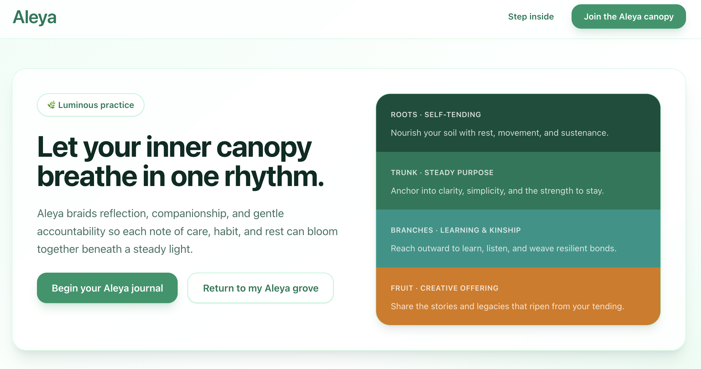
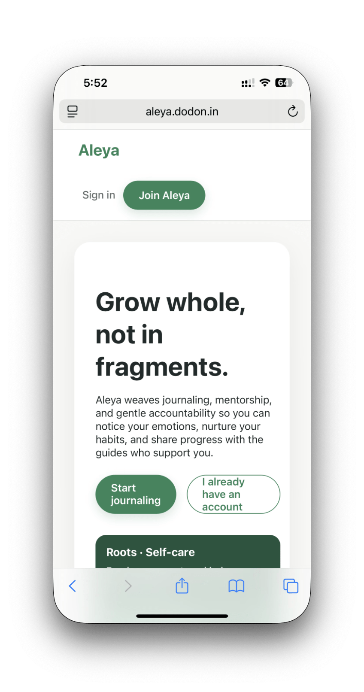
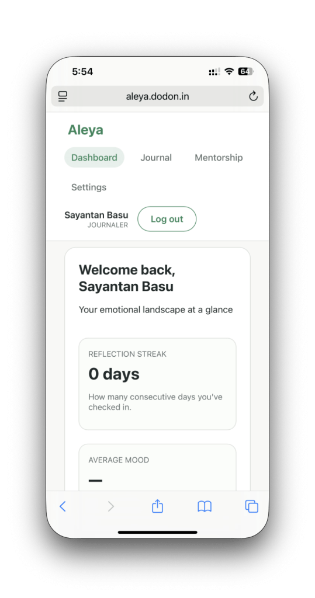

# Aleya

Aleya is a journaling and mentorship platform that pairs reflective prompts with
mentor support. The repository hosts an Express + PostgreSQL API (`backend/`) and a
React client (`frontend/`). This refresh tidies the repository layout, adds automated
quality checks, and documents how to grow the grove together.

## Demo

A live demo is available here: [Demo App](https://aleya.dodon.in)

**Important notes**
- The demo server may be offline at times (it is rebuilt daily).
- **All data is reset once per day** — do not use it for important storage.
- The demo is provided for evaluation and testing purposes only.

### Landing Page




### Mobile Layout Screenshots
<p align="center">
  
  
</p>

## Table of contents

- [Aleya](#aleya)
  - [Demo](#demo)
    - [Landing Page](#landing-page)
    - [Mobile Layout Screenshots](#mobile-layout-screenshots)
  - [Table of contents](#table-of-contents)
  - [Architecture](#architecture)
  - [Getting started](#getting-started)
  - [Running the backend](#running-the-backend)
    - [Mentor digest job](#mentor-digest-job)
  - [Running the frontend](#running-the-frontend)
  - [Quality gates](#quality-gates)
  - [Testing](#testing)
  - [Environment \& configuration](#environment--configuration)
  - [Project documentation](#project-documentation)
  - [Contributing](#contributing)
  - [License](#license)

## Architecture

```
.
├── backend/            # Express API, PostgreSQL helpers, automated jobs
│   ├── src/            # Application source code
│   ├── tests/          # Jest unit tests
│   └── docs/           # Schema references and backend-specific guides
├── frontend/           # React application powered by CRA + Tailwind
├── docs/               # Living knowledge base (Wiki, theme showcase, features)
├── .github/workflows/  # Continuous integration pipelines
├── docker-compose.yml  # Optional local orchestration for backend + frontend
└── README.md
```

Key product personas:

- **Journalers** cultivate habits through poetic, mood-aware prompts.
- **Mentors** guide journalers with dashboards, digests, and panic alerts.
- **Administrators** steward forms, relationships, and health metrics.

Core highlights include mutual-consent mentor linking, mood analytics, panic
support, and a dashboard suite for each role. The retired in-app notification
system has been replaced with transactional email flows.

## Getting started

Clone the repository and install dependencies for both packages.

```bash
git clone <repository-url>
cd Aleya

# Backend setup
cd backend
npm install

# Frontend setup (in a separate shell)
cd frontend
npm install
```

Node.js 18+ is recommended for parity with the Docker images and CI pipeline.

## Running the backend

```bash
cd backend
cp .env-sample .env   # populate with your database + SMTP credentials
npm run dev           # start the API with Nodemon
```

The server boots from `backend/src/index.js`, validates SMTP credentials via
`src/utils/email.js`, and initialises the platform if seed credentials are
provided. API routes live under `src/routes/` and reuse shared middleware,
services, and utilities.

### Mentor digest job

```
npm run mentor-digest
```

Dispatches mentor digest emails for the configured look-back window. Update the
`MENTOR_DIGEST_WINDOW_HOURS` environment variable to tweak the range.

## Running the frontend

```bash
cd frontend
cp .env-sample .env    # configure API origin and feature flags
npm start              # run the React development server
```

The client leans on shared Tailwind tokens defined in `frontend/src/index.css`.
Admin dashboards reuse the responsive table tokens documented in
`frontend/AGENTS.md`.

## Quality gates

Automated checks live in `.github/workflows/ci.yml` and run on every push or
pull request:

- `npm run format:check` – ensures Prettier formatting for backend sources/tests.
- `npm run lint` – ESLint (recommended + Prettier) for backend code.
- `npm test` – Jest unit tests for backend utilities.

Run them locally before you push:

```bash
cd backend
npm run format:check
npm run lint
npm test
```

Frontend testing remains available through `npm test` inside the `frontend/`
directory.

## Testing

Unit tests live under `backend/tests/` and currently cover shared helpers such as
`src/utils/mood.js`. Add new tests alongside the modules you touch. Test output
is written to `backend/coverage/` (ignored by Git).

Integration tests can be added with Jest + Supertest; wire them into the
`backend/tests/` tree and update the CI workflow accordingly.

## Environment & configuration

- `backend/.env-sample` documents required credentials for the API, including
  PostgreSQL, JWT, logging, and SMTP settings.
- `frontend/.env-sample` lists client configuration such as the API base URL.
- Docker users can run `docker compose up --build` to orchestrate both services
  (PostgreSQL is expected to be provisioned separately).

## Project documentation

- `docs/Wiki.md` – running history of architectural and feature decisions.
- `docs/features.md` – product capabilities and future opportunities.
- `docs/theme.html` – static showcase of Tailwind tokens shared by the UI.
- Package-specific `AGENTS.md` files capture conventions for each area; update
  them whenever you introduce new patterns.

## Contributing

Please read [CONTRIBUTING.md](CONTRIBUTING.md) for the full workflow, coding
standards, and review expectations. Community expectations are outlined in the
[CODE_OF_CONDUCT.md](CODE_OF_CONDUCT.md).

Highlights:

- Keep backend code in `src/` and add Jest tests beside the behaviour you change.
- Update the wiki (`docs/Wiki.md`) and relevant `AGENTS.md` files with every
  substantial change.
- Run the quality gates (format, lint, test) before requesting review.

## License

This project is licensed under the [MIT License](LICENSE).
